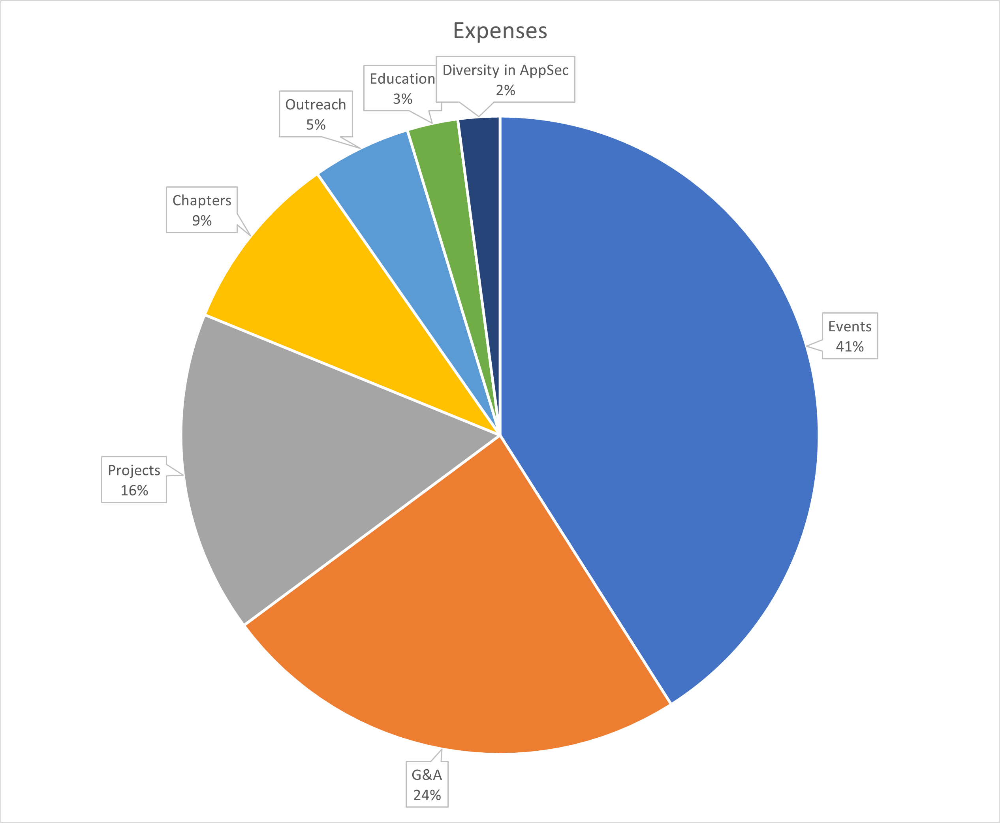

---

title: 2022 Budget
layout: full-width

---

## OWASP 2022 Budget

APPROVED by Board of Directors at the [January 2022 Board Meeting](https://owasp.org/www-board/meetings-historical/202201#motion-to-approve-the-2022-budget)


### 2021 Financial Performance

With the assistance of OWASP's 20th Anniversary, 2021 turned out to be a far better year than expected. The approved 2021 budget was exceeded in nearly all respects.

| Description | Budgeted | Actual | Percent |
|-------------|----------|-------|-------|
| Income | $1,000,000 | $1,000,000 | 100% |
| Expenses | $1,000,000 | $1,000,000 | 100% |


### 2022 Income Forecast

Income in 2022 is projected to be $2.2 million, which is $1.1 million more than the 2021 actual.

### 2022 Expenses Forecast

Expenses in 2022 are up by x% since 2021. This is a good time to invest as we start to come out of the COVID era.



### Future outlook

As we emerge from COVID, resuming in person events raises costs, but also raises income, which should only improve OWASP's financial performance. We continue to look for ways to reduce expenses, such as eliminating make work and consolidation of platforms, and invest in ways to reduce costs, such as the new Association Management Platform.

## Charity Spending Guidelines

Generally, it is best practice for non-profits to spend at least 80% of their funding on "Programs" - with the goal of getting to 85% or better. The FY22 budget forecasts the OWASP Foundation will spend 68.1% of its funds on Programming. A major goal is to get this to 80% by increasing revenue and maintaining low expenses through out the year.


## FY 2022

```
Income                     CASH BASIS
    Conferences
        Registration
            Global AppSec
                Global AppSec Virtual EU       $100,000
                Global AppSec Virtual ASIA Pac $25,000
                Global AppSec in person SF     $265,000
            AppSec Days
                EU events                      $40,000
                LASCON 2022                    $85,000
        Event Sponsorships
            Global AppSec
                Global AppSec Virtual EU       $200,000
                Global AppSec Virtual ASIA Pac $200,000
                Global AppSec in person SF     $400,000
        Other Conferences
            Career Fair                        $10,000
            Training                           $50,000
            Developer Summit                   $0

    GSOC                                       $6,000
    Grant income                               $100,000
    Bequests
    Membership
            Individual                         $300,000
            Corporate                          $250,000
    Fundraising and Donations
            Corporate                          $50,000
            Individual                         $30,000
    Merchandise (drop shipping)                $4,000
    Trademark licensing                        $40,000
    Interest
Total Income     $2,155,000

Expenses
    Events Program
        Global AppSec Virtual EU               $50,000
        Global AppSec Virtual ASIA Pac         $50,000
        Global AppSec in person SF             $520,000
        Staff salary                           $182,560

            LASCON 2022                        $55,000
            Entertainment based events
            Career Fair                        $7,500
            Training                           $18,080
            Developer Summit                   $0
        AppSec Days Seed Fund
        Bonus/Commission                       $0
    Projects and Technology Program
        Project Virtual Summit (x2)
        Online Books
        Grants                                 $90,000
        Learning platform
        Project Expenses                       $60,000
        Awards
        Scholarships
        Marketing                              $18,000
        Staff salary                           $183,813
        Project Platform fees

    Outreach and Marketing Program
        Outreach Virtual Event
        Merchandise costs
        Grants
        CC fees for membership                 $9,000
        Awards
        Scholarships
        Marketing                              $18,000
        Staff salary                           $81,009
        Local Partnerships
        Global Partnerships
        Online
        Branding & Trademarks
        Event Promotions
        Public Relations

    Chapters and Members Program
        Grants
        Assoc mgt system                       $30,000
        Awards
        Chapter pool/seed funds                $60,000
        Scholarships
        Membership rewards
        Staff salary                           $66,672
        Local Events
        Chapter Platform Fees                  $40,000

    WIA, Diversity and Inclusion
        Grants
        Expenses
        Awards
        Scholarships
        Marketing
        Staff salary                           $45,663
        Local Events
        WIA, Diversity and Inclusion Virtual Event (x2)

    Education and Training
        Grants
        Expenses
        Awards
        Scholarships
        Marketing
        Staff salary                           $55,503
        Education Virtual Summit (x2)

    General and Administrative
    Travel
            Board F2F Meetings                 $25,000
            Projects Summit Travel Assistance
            General Travel Assistance
            Staff                              $10,000
    Legal & Insurance                          $20,000
    Staffing
            General & Administration           $136,735
            Fundraising & Development          $69,214
    US CPA                                     $3,000
    US Financial services                      $108,000
    EU Expenses                                $43,000
    Bank Service Charges                       $21,368
    Other G&A                                  $40,856
    Software/Internet/Hosting                  $31,885
    Portal & Web                               $4,871
    Replacement tech contingency
    Bad Debt                                   $-
Total Expenses     $2,154,732

P/L     $268
```

## Quarterly Plan

```
            Q1          Q2          Q3          Q4       Total
Income      $201,000    $591,000    $422,000    $941,000 $2,155,000
Expenses    $338,683    $507,061    $338,683    $920,183 $2,154,732
                                                         $268
```

FY22 apportions program management and staff costs to program delivery, which is aligned with common non-profit accounting practices, and also ensures that each program delivery area has an opportunity to earn income, fundraising and sponsorships, rather than solely rely upon Foundation income from global events and event sponsorship.
